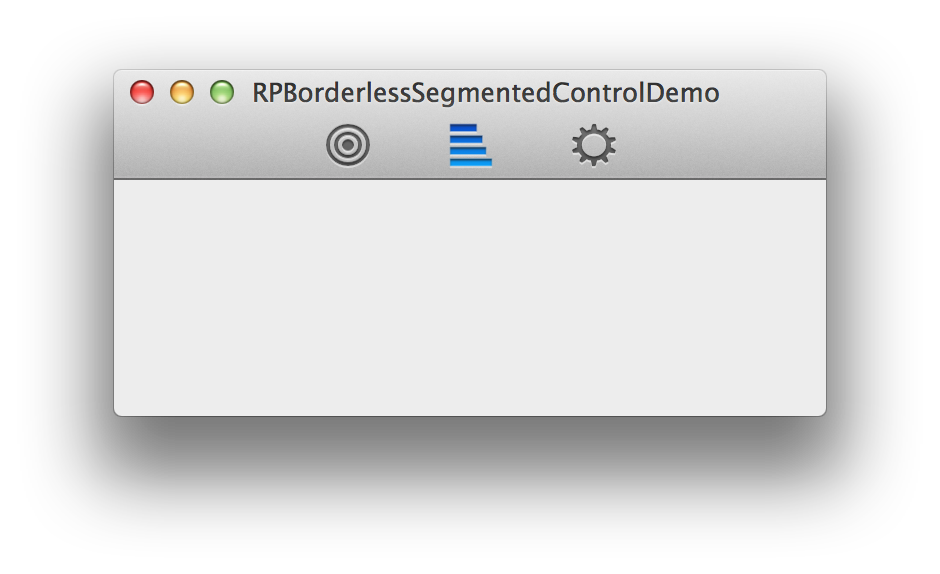

# RPBorderlessSegmentedControl

A replica of Xcode 5's toolbar segmented controls.

RPBorderlessSegmentedControl is based on [Ole Zorn's Stack Overflow response](http://stackoverflow.com/a/7138497/1082395) with some additional changes and updates.

## Usage

To run the example project: clone the repo and open the workspace file in Demo/

## Notes

- Your segment images should be 24px high and have a 1px padding along the top for proper shadow rendering.

## Installation

RPBorderlessSegmentedControl is available through [CocoaPods](http://cocoapods.org), to install
it simply add the following line to your Podfile:

    pod "RPBorderlessSegmentedControl"

## Contact

Follow Robots & Pencils on Twitter ([@robotsNpencils](https://twitter.com/robotsNpencils))

### Maintainers

- [Brandon Evans](http://github.com/interstateone) ([@interstateone](https://twitter.com/interstateone))

## License

RPBorderlessSegmentedControl is available under the MIT license. See the LICENSE file for more info.

